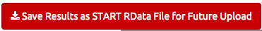

**The Pepliner app is for viewing peptide or protein elution profiles**

- *Explore* the app's features with the example data set pre-loaded by clicking on the tabs above.
- *Upload* your data in the "Input Data" tab.

###  Features

*Visualize your data:*

- clustering (PCA plots, heatmaps)
- group comparisons (scatterplots, volcano plots)
- gene-level boxplots of expression values

###  Data Format

- Must be a .CSV *comma-separated-value* file (you may export from Excel).
- File must have a header row.
 
#### Protein data

- Must be a .CSV *comma-separated-value* file (you may export from Excel).

##### Tidy format
- Must contain columns ID, ProteinCount, FractionID
- Each row is a protein's detection in a single fraction

##### Wide format
- Must contain a column called ID, with remaining columns representing individual fractions
- Each row is a proteins's detection across fractions
 
#### Peptide data

- Must be a .CSV *comma-separated-value* file (you may export from Excel).

##### Tidy format
- Must contain columns Peptide, ID, PeptideCount, FractionID
- Each row is a peptide's detection in a single fraction

##### Wide format
- Must contain a columns called Peptide and ID, with remaining columns representing individual fractions
- Each row is a peptide's detection across fractions

####  *TIP*: Save Data for Future Upload

After uploading your data to START, click red button

to download an .RData file to upload your data to START with one click.

Next time use the "Input Data" tab --> "START RData file" option.

####  More Help and Info

Additional help information and more detailed instructions are provided under the "Instructions" tab.

#### App Info

#### Provenance

Pepliner was modified from the START app developed by Jessica Minnier, Jiri Sklenar, Anthony Paul Barnes, and Jonathan Nelson
of Oregon Health & Science University, Knight Cardiovascular Institute and School of Public Health.

[Nelson, JW, Sklenar J, Barnes AP, Minnier J. (2016) "The START App: A Web-Based RNAseq Analysis and Visualization Resource." Bioinformatics.  doi: 10.1093/bioinformatics/btw624.](http://bioinformatics.oxfordjournals.org/content/early/2016/09/27/bioinformatics.btw624.abstract)

The source code of START is available on [Github](https://github.com/jminnier/STARTapp).

